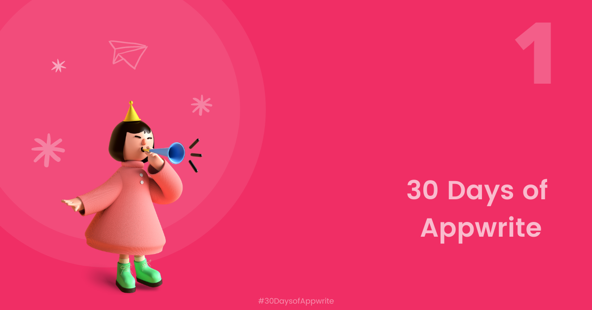

<br />
<p align="center">
    <a href="https://30days.appwrite.io/" target="_blank"></a>
    <br />
    <br />
    
    <br />
    <br />
    <b>Landing page for 30 Days of Appwrite</b>
</p>

[](https://appwrite.io/discord)
[](https://twitter.com/appwrite_io)
[](https://stackshare.io/appwrite)

[#30DaysOfAppwrite](https://30days.appwrite.io/) is a month long event focussed at giving developers a walkthrough of all of Appwrite's features, starting from the basics to more advanced features like Cloud Functions! Alongside, we will also be building a fully featured Medium Clone to demonstrate how these concepts can be applied when building a real world app. We also have some exciting prizes for developers who follow along with us!

## Getting Started
This project was built using Vue.js + Vite. 

1. Clone this repository
   ```bash
   git clone https://github.com/appwrite/30dayofappwrite.git
   cd 30dayofappwrite
   ```

1. Change to the folder you wish to use
   ```bash
   cd 30dayofappwrite
   ```

1. Install the npm packages
   ```bash
   npm install
   ```

1. Run the app!

   ```bash
   npm run dev
   ```

